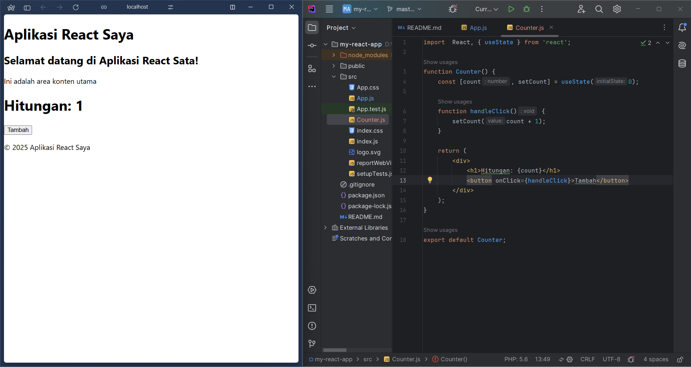
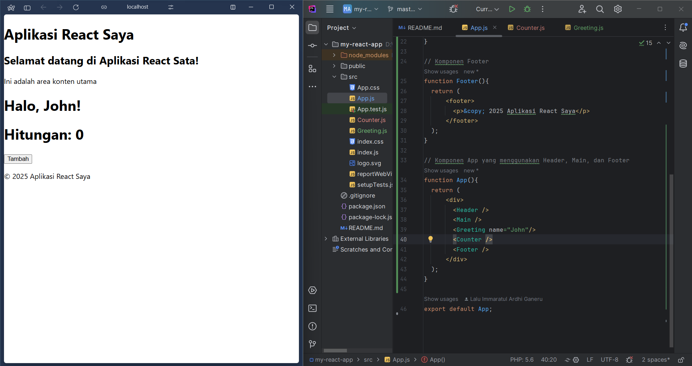
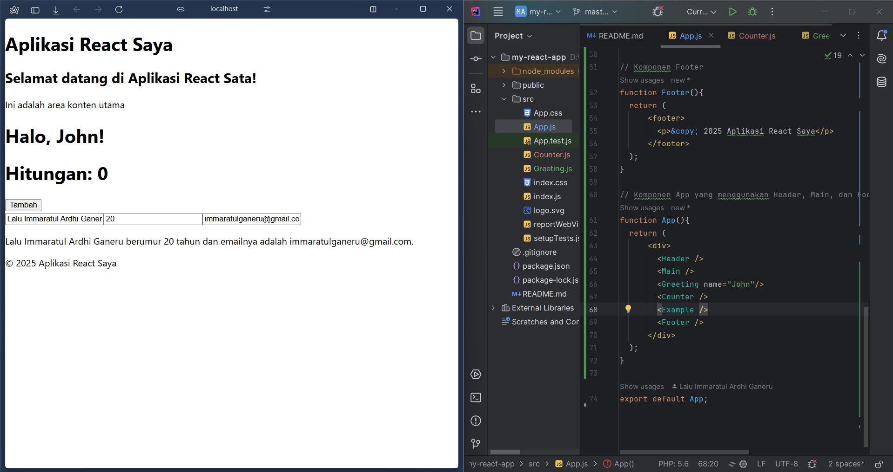
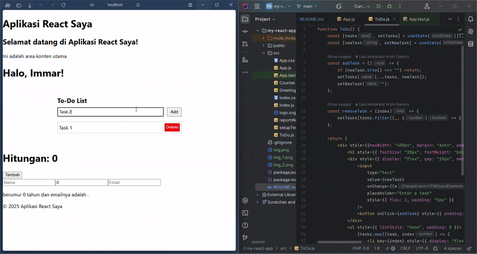

# Getting Started with Create React App

This project was bootstrapped with [Create React App](https://github.com/facebook/create-react-app).

## Laporan Praktikum

|  | Pemrograman Berbasis Framework 2025 |
|--|--|
| NIM |  2241720169|
| Nama |  Lalu Immaratul Ardhi Ganeru |
| Kelas | TI - 3B |

## Membuat Komponen Dinamis

## Menggunakan Props Untuk Mengirim Data

## Menggunakan State

## To do List

